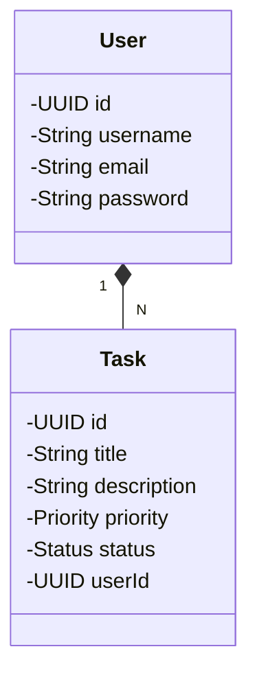

# To do list API

### Description

This application allows the user to register, login, add, modify and delete tasks. It has unit tests with Mockito and JUnit

## Class diagram

### Stacks Used

* [Java 17](https://www.oracle.com/java/technologies/javase/jdk17-archive-downloads.html)
* [Spring](https://spring.io/)
* [Intellij IDEA Community](https://www.jetbrains.com/idea/)

### Technical Requirements

* Java 17

### How to Run the Application

Clone the repository/download and unzip the source code and run using an IDE.

## Note

The application was designed to perform the search by consulting an API hosted on an EC2 instance of AWS.
