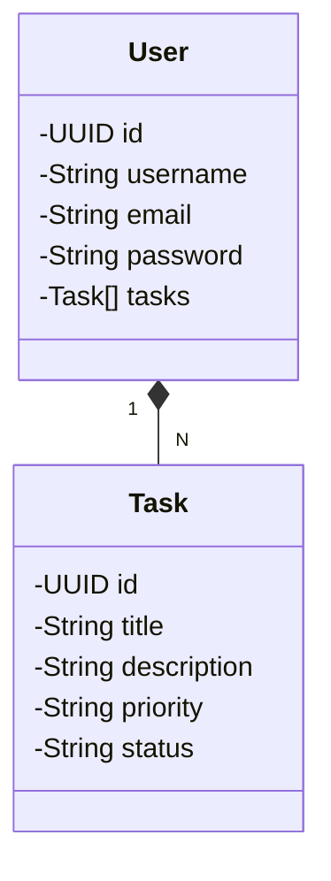

# To do list API

## Class diagram

```mermaid
classDiagram
    class User {
        -UUID id
        -String username
        -String email
        -String password
        -Task[] tasks
    }
    
    class Task {
        -UUID id
        -String title
        -String description
        -String priority
        -String status
    }

    User "1" *-- "N" Task
```
